<div align="center">

# 👋 Hello, I'm Tokimeki Marinosuke

### 💀 I have no idea why this works.


</div>

---

## 🚧 Current Status

```txt
🤢 It's working. Don't touch it.
🔥 99 bugs in the code. Don't make it 100.
🚀 Works on my machine™
```

---

## 🎮 Current Project

# 🦊 雫と狐とからくり屋敷

A Japanese horror roguelike game built with Unity.

### Features

- 🏚️ Procedurally generated Karakuri Mansion
- 🦊 Fox companion system
- 👻 Japanese horror atmosphere
- 🎲 Roguelike exploration
- 🔑 Multiple endings

---

## 💻 Languages


---

## 🛠 Tools


---

## 📊 Statistics





---

## ⚠️ Disclaimer

```cpp
while(project.isWorking())
{
    doNotTouch();
}
```

---

<div align="center">

### 🦊 Building technical debt since 2025

</div>
<!--
**tokimeki-marinosuke/tokimeki-marinosuke** is a ✨ _special_ ✨ repository because its `README.md` (this file) appears on your GitHub profile.

Here are some ideas to get you started:

- 🔭 I’m currently working on ...
- 🌱 I’m currently learning ...
- 👯 I’m looking to collaborate on ...
- 🤔 I’m looking for help with ...
- 💬 Ask me about ...
- 📫 How to reach me: ...
- 😄 Pronouns: ...
- ⚡ Fun fact: ...
-->
